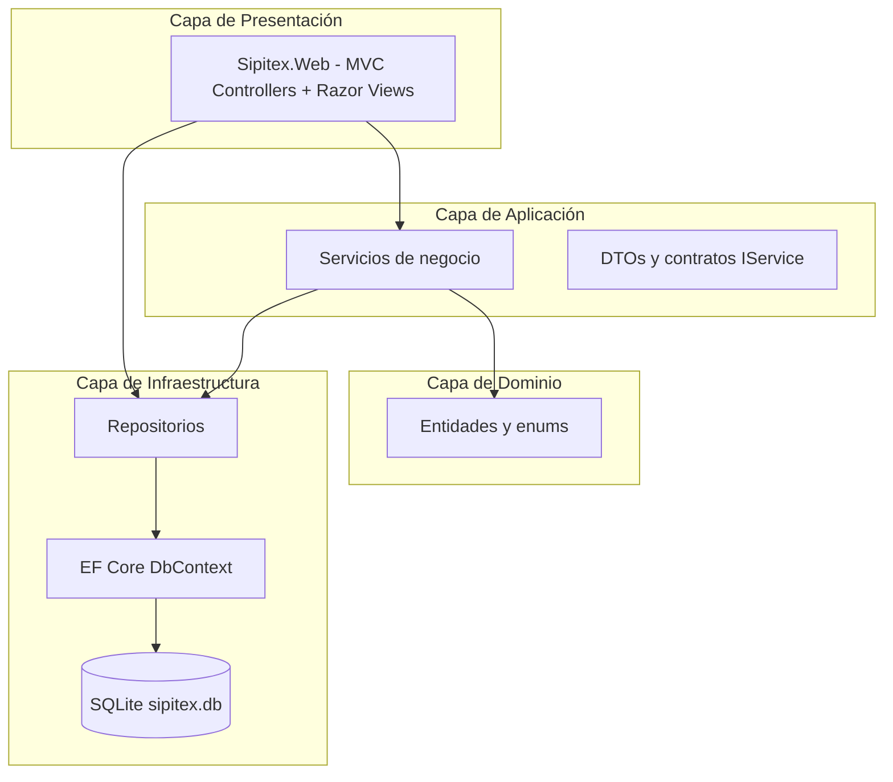
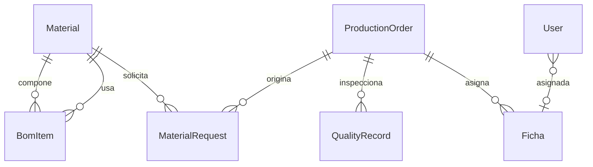

# Fase 2 — Diseño del sistema (Cascada)

## 2.1 Arquitectura por capas

## 2.2 Modelo de datos (ER simplificado)

## 2.3 Servicios de aplicación

| Servicio | Responsabilidad |
|----------|-----------------|
| `IInventoryService` | Materiales, stock, solicitudes |
| `IProductionOrderService` | CRUD órdenes, consumo BOM |
| `IMrpService` | BOM y simulación MRP |
| `IFichaService` | Registro producción por ficha |
| `IQualityService` | Inspecciones |
| `IStatisticsService` | KPIs y gráficos |
| `IUserAccountService` | Autenticación y CRUD de usuarios |

## 2.4 Patrones aplicados

- **Repository + Unit of Work** — abstracción de persistencia  
- **DTO** — desacoplar entidades de la UI  
- **Dependency Injection** — registro en `Program.cs` / extensiones  

## 2.5 Entregable de fase

Diagramas, contratos de interfaces y esquema de BD → implementación (Fase 3).
