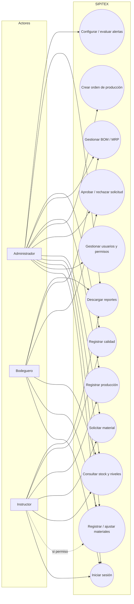
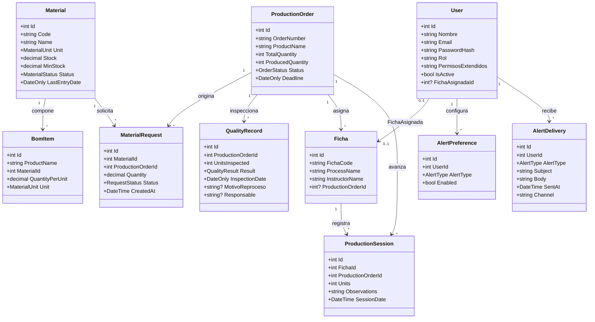
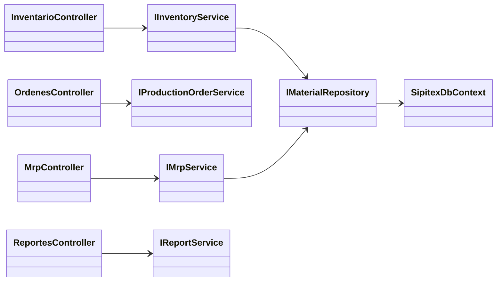
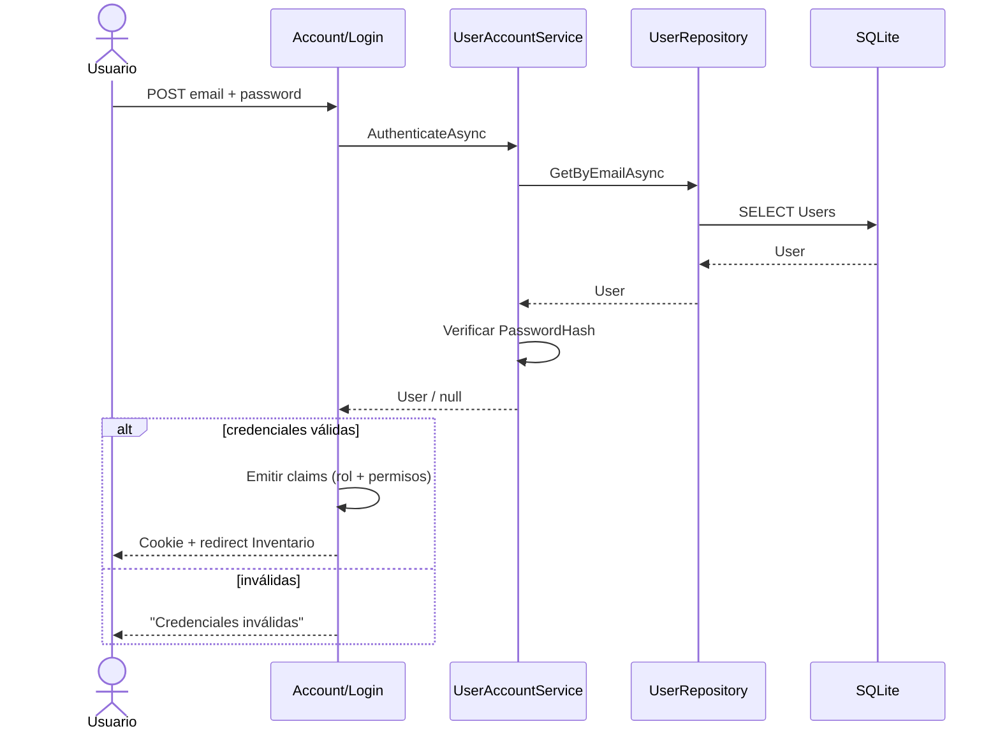
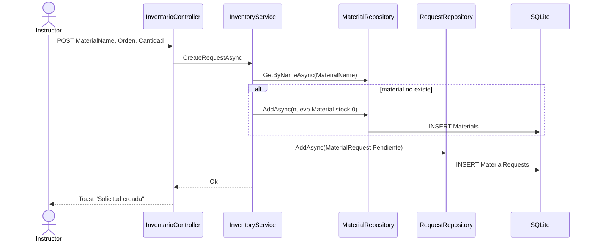
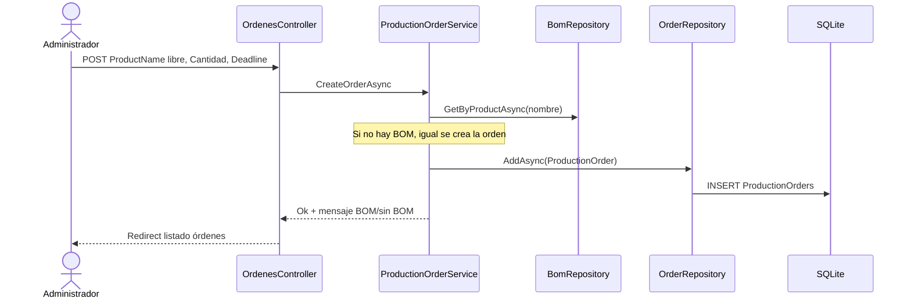
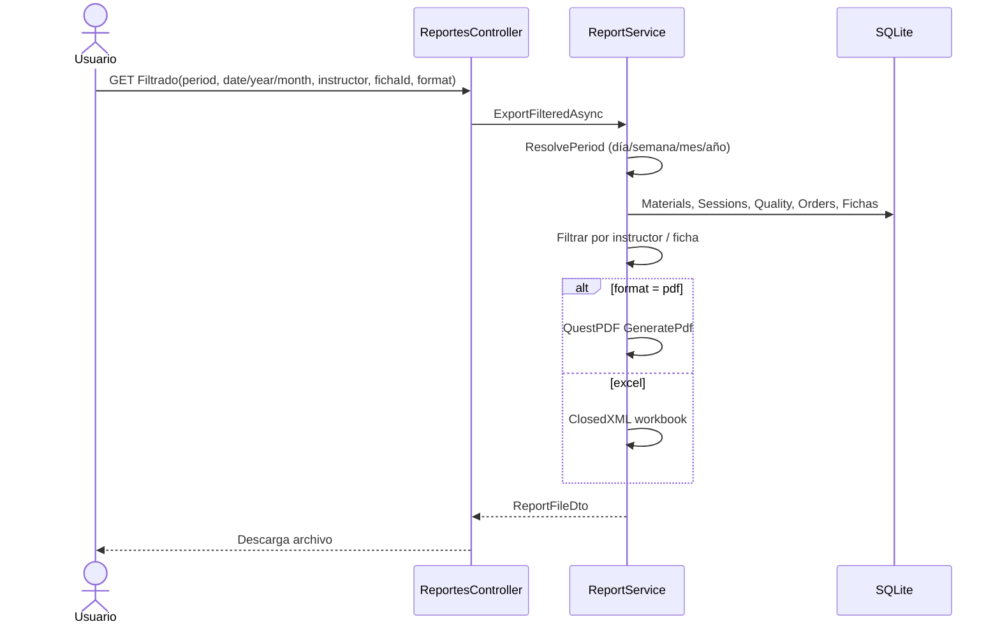
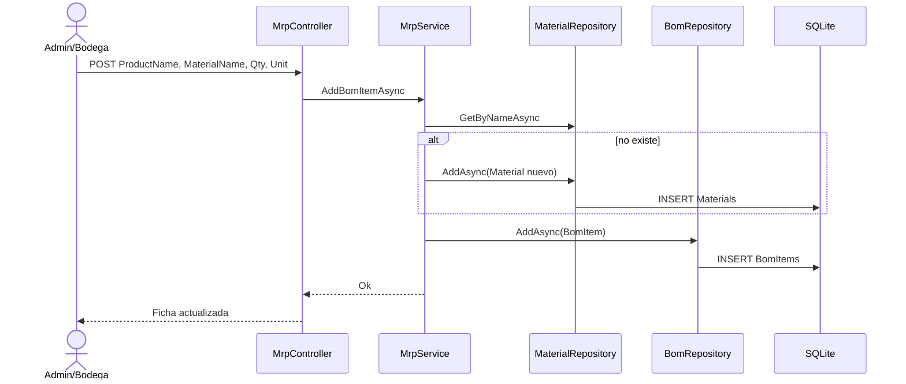
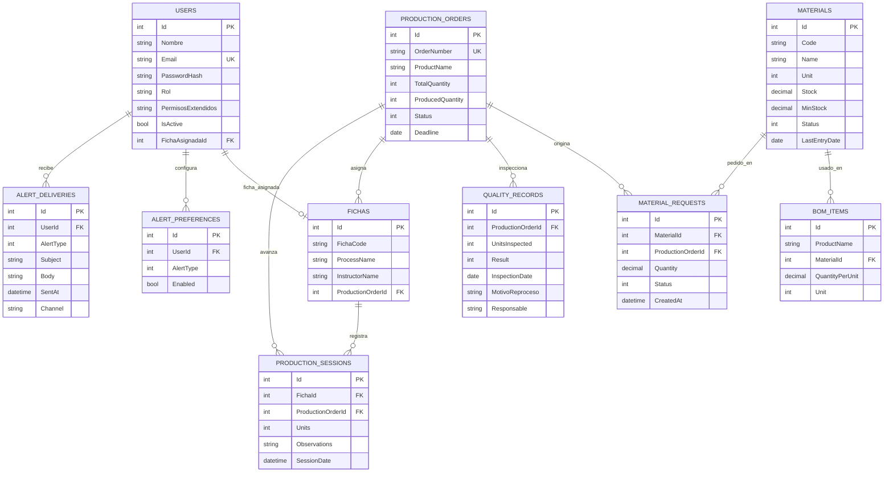

# Especificación de Requisitos de Software (SRS)
## Norma IEEE 830-1998 — SIPITEX

| Campo | Valor |
|-------|--------|
| **Proyecto** | SIPITEX — Sistema Integrado de Aprendizaje, Producción e Inventario Textil |
| **Institución** | SENA CMTC · ADSO |
| **Versión** | 2.0 |
| **Fecha** | 2026-07-23 |
| **Estado** | Alineado con la implementación actual (ASP.NET Core MVC + EF Core + SQLite) |
| **Autores** | Equipo SIPITEX / COSTEsincelejo |

> **Nota:** El documento sigue la estructura recomendada por **IEEE Std 830-1998** (*IEEE Recommended Practice for Software Requirements Specifications*).

---

## 1. Introducción

### 1.1 Propósito

Definir los requisitos funcionales y no funcionales del sistema SIPITEX, servir de contrato entre stakeholders (instructores, bodega, administración del centro) y el equipo de desarrollo, y documentar el diseño de alto nivel mediante diagramas UML y modelo entidad-relación.

### 1.2 Alcance

SIPITEX gestiona, en entorno intranet del centro de formación:

- Inventario de materias primas (cualquier material).
- Órdenes de producción de **cualquier producto/prenda**.
- MRP / ficha técnica (BOM) configurable.
- Solicitudes de material para producción.
- Fichas de aprendices y registro de sesiones.
- Control de calidad (aprobado / reproceso).
- Reportes PDF/Excel (diario, semanal, mensual, anual, por instructor y por ficha).
- Alertas por correo (SMTP o outbox de demostración).
- Autenticación por roles y permisos extendidos otorgados por el administrador.

**Fuera de alcance (v2.0):** facturación, nómina, integración con ERP externo, app móvil nativa.

### 1.3 Definiciones, acrónimos y abreviaturas

| Término | Definición |
|---------|------------|
| **BOM** | *Bill of Materials* — lista de materiales por unidad de producto |
| **MRP** | *Material Requirements Planning* — cálculo de requerimiento neto |
| **RF** | Requisito funcional |
| **RNF** | Requisito no funcional |
| **Ficha** | Grupo / proceso de formación asociado a un instructor |
| **SRS** | *Software Requirements Specification* |

### 1.4 Referencias

- IEEE Std 830-1998.
- Documentación interna: `docs/01-Requisitos.md` … `docs/05-Despliegue.md`.
- Código fuente: repositorio `-SIPITEX` (ramas `main` / `cursor/ui-responsive-b7ea`).

### 1.5 Panorama

Este SRS describe el *qué* del sistema. La arquitectura por capas, despliegue Docker y pruebas se detallan en los documentos de fases 2–5.

---

## 2. Descripción general

### 2.1 Perspectiva del producto

Aplicación web monolítica en capas (Clean Architecture simplificada):

```
Sipitex.Web (MVC + Razor + Cookies)
        ↓
Sipitex.Application (servicios, DTOs)
        ↓
Sipitex.Domain (entidades, enums)
        ↑
Sipitex.Infrastructure (EF Core, SQLite, reportes, correo)
```

### 2.2 Funciones del producto (resumen)

1. Autenticar usuarios y autorizar por rol/permiso.
2. Registrar y consultar materiales con niveles Agotado / Por agotarse / Normal.
3. Crear órdenes para cualquier producto.
4. Mantener BOM y simular MRP.
5. Solicitar / aprobar / rechazar salidas de bodega.
6. Registrar producción por ficha y avance de orden.
7. Registrar inspecciones de calidad.
8. Generar reportes filtrables y alertas.

### 2.3 Características de los usuarios

| Actor | Perfil | Interacción principal |
|-------|--------|------------------------|
| Administrador | Gestión del sistema | Usuarios, permisos, órdenes, reportes, alertas |
| Bodeguero | Almacén | Stock, estado físico, aprobación de solicitudes |
| Instructor | Formación / línea | Solicitudes, sesiones de producción (y funciones admin si se otorgan) |

### 2.4 Restricciones

- Base de datos SQLite en desarrollo/intranet (archivo `sipitex.db`).
- Autenticación por cookies (no JWT en la implementación actual).
- Navegadores modernos; UI responsiva.
- Despliegue opcional con Docker Compose.

### 2.5 Supuestos y dependencias

- Red local disponible.
- Usuarios semilla de demo: `admin@sipitex.test` / `Admin123!` (y roles instructor/bodega).
- Para alertas reales se configura SMTP; si no, se usa carpeta `email-outbox/`.

---

## 3. Requisitos específicos

### 3.1 Requisitos funcionales

| ID | Módulo | Descripción | Prioridad |
|----|--------|-------------|-----------|
| RF01 | Usuarios | CRUD de usuarios por rol (Admin / Instructor / Bodeguero) | Alta |
| RF02 | Usuarios | Autenticación con sesión (cookies) y cierre de sesión | Alta |
| RF03 | Usuarios | Permisos extendidos otorgados por el administrador | Alta |
| RF04 | Inventario | Registrar cualquier material (nombre, stock, mínimo, unidad) | Alta |
| RF05 | Inventario | Consultar stock y filtrar por Agotado / Por agotarse / Normal | Alta |
| RF06 | Inventario | Actualizar estado físico (Bueno / Regular / Deteriorado) | Media |
| RF07 | Inventario | Ajustar stock y fecha de última entrada | Media |
| RF08 | Salida | Solicitar cualquier material para una orden (crear material si no existe) | Alta |
| RF09 | Salida | Aprobar / rechazar solicitud y descontar stock al aprobar | Alta |
| RF10 | Órdenes | Crear orden con **cualquier nombre de producto** | Alta |
| RF11 | Órdenes | Registrar avance de producción y finalizar al alcanzar meta | Alta |
| RF12 | MRP | Mantener BOM por producto; material libre (texto) | Alta |
| RF13 | MRP | Simular requerimiento neto vs stock disponible | Alta |
| RF14 | Fichas | Asociar ficha a proceso / instructor / orden | Alta |
| RF15 | Producción | Registrar sesión diaria: ficha, unidades, observaciones | Alta |
| RF16 | Calidad | Registrar inspección; en reproceso exigir motivo y responsable | Media |
| RF17 | Reportes | Exportar inventario, órdenes, calidad y dashboard (PDF/Excel) | Alta |
| RF18 | Reportes | Reporte filtrado: diario, semanal, mensual, anual, instructor, ficha | Alta |
| RF19 | Alertas | Preferencias por usuario y evaluación (stock bajo, órdenes, etc.) | Media |
| RF20 | Estadísticas | Dashboard KPI y gráfico de avance | Alta |

### 3.2 Requisitos no funcionales

| ID | Descripción |
|----|-------------|
| RNF01 | Tiempo de respuesta percibido &lt; 2 s en intranet para pantallas habituales |
| RNF02 | Sesión autenticada con expiración (8 h) |
| RNF03 | Control de acceso por rol y permisos extendidos |
| RNF04 | Acceso desde PCs de la intranet del centro |
| RNF05 | Interfaz responsiva (móvil / escritorio) |
| RNF06 | Código modular por capas y documentado |
| RNF07 | Despliegue reproducible (Docker Compose opcional) |
| RNF08 | Integridad referencial y transacciones vía EF Core / SQLite |

### 3.3 Interfaces externas

- **Usuario:** navegador web (HTML/CSS/JS).
- **Hardware:** servidor HTTP / contenedor Docker.
- **Software:** .NET 10, EF Core, QuestPDF, ClosedXML, MailKit.
- **Comunicaciones:** HTTP(S) local; SMTP opcional para alertas.

---

## 4. Diagramas

### 4.1 Diagrama de casos de uso



#### Matriz actor ↔ caso de uso

| Caso de uso | Admin | Bodeguero | Instructor |
|-------------|:-----:|:---------:|:----------:|
| Iniciar sesión | ✓ | ✓ | ✓ |
| Gestionar usuarios/permisos | ✓ | | |
| Registrar materiales | ✓ | ✓ | permiso |
| Consultar stock | ✓ | ✓ | ✓ |
| Solicitar material | ✓ | | ✓ |
| Aprobar/rechazar | ✓ | ✓ | permiso |
| Crear orden | ✓ | | |
| Registrar producción | ✓ | | ✓ |
| BOM / MRP | ✓ | ✓ | permiso |
| Calidad | ✓ | | ✓ |
| Reportes | ✓ | ✓ | ✓ |
| Alertas | ✓ | parcial | parcial |

---

### 4.2 Diagrama de clases (dominio)



#### Capas de aplicación (vista lógica)



---

### 4.3 Diagramas de secuencia

#### 4.3.1 Login



#### 4.3.2 Solicitar material (cualquier nombre)



#### 4.3.3 Aprobar solicitud y descontar stock

```mermaid
sequenceDiagram
  actor B as Bodeguero
  participant V as InventarioController
  participant S as InventoryService
  participant DB as SQLite

  B->>V: POST ApproveRequest(id)
  V->>S: ApproveRequestAsync
  S->>S: Validar Pendiente y stock >= cantidad
  alt stock insuficiente
    S-->>V: Fail
    V-->>B: Error
  else ok
    S->>S: Stock -= cantidad; Status = Aprobada
    S->>DB: UPDATE Materials, MaterialRequests
    S-->>V: Ok
    V-->>B: "Solicitud aprobada"
  end
```

#### 4.3.4 Crear orden de cualquier producto



#### 4.3.5 Descargar reporte filtrado



#### 4.3.6 Agregar material libre al BOM (MRP)



---

### 4.4 Diagrama entidad-relación (ER)



---

## 5. Apéndices

### 5.1 Credenciales de demostración

| Rol | Correo | Contraseña |
|-----|--------|------------|
| Administrador | `admin@sipitex.test` | `Admin123!` |
| Instructor | `instructor@sipitex.test` | `Instructor123!` |
| Bodeguero | `bodega@sipitex.test` | `Bodega123!` |

### 5.2 Ejecución local

```bash
cd /workspaces/-SIPITEX   # o raíz del repo
dotnet watch run --project src/Sipitex.Web
```

### 5.3 Historial de versiones del SRS

| Versión | Fecha | Cambios |
|---------|-------|---------|
| 1.0 | 2025 | Requisitos iniciales RF01–RF20 |
| 2.0 | 2026-07-23 | Auth cookies, permisos, productos/materiales libres, reportes filtrables, diagramas UML/ER actualizados |

---

*Fin del documento IEEE 830 — SIPITEX v2.0*
