# PROYECTO FORMATIVO SENA
# SIPITEX — Sistema Integrado de Producción e Inventario Textil

**Institución:** SENA · CMTC · Programa ADSO  
**Presentado por:** Cristian Camilo Baena Ruiz  
**Correo:** cristianccbr@gmail.com  
**Versión:** 1.0 · Julio 2026  
**Alcance de este documento:** puntos 1 al 9

---

## Contenido

1. Levantamiento de información  
2. Informe de requerimientos  
3. Hardware del cliente  
4. Diagrama de Gantt  
5. Casos de uso  
6. Diagrama de flujo  
7. Diagrama de clases  
8. Diagrama de distribución  
9. Modelo entidad relación  

---

# 1. Levantamiento de información

## 1.1 Contexto del problema

El Centro de Manufactura en Confección y Textiles (CMTC) del SENA requiere un sistema informático que permita controlar de forma integrada:

- El inventario de materias primas textiles (telas, hilos, avíos).
- Las órdenes de producción de prendas.
- El cálculo de requerimientos de materiales (MRP / BOM).
- El registro de producción por fichas de aprendices.
- Las inspecciones de calidad.
- Los reportes e indicadores (KPI) para la toma de decisiones.

Actualmente, parte de esta información se maneja de forma dispersa (hojas de cálculo, registros manuales o comunicación verbal entre bodega, instructores y administración), lo que genera:

- Desconocimiento del stock real en tiempo real.
- Dificultad para aprobar o rechazar salidas de material con trazabilidad.
- Falta de avance consolidado de órdenes frente a la meta.
- Reportes lentos o incompletos para la coordinación académica-productiva.

## 1.2 Técnicas de recolección

| Técnica | Descripción | Resultado |
|---------|-------------|-----------|
| Entrevistas | Conversaciones con instructores, bodeguero y administración del área textil | Identificación de roles, permisos y flujos diarios |
| Observación | Revisión del proceso de solicitud de materiales y registro de producción | Flujo de solicitud → aprobación → descuento de stock |
| Análisis documental | Revisión de formatos de inventario, fichas y órdenes | Atributos mínimos de materiales, órdenes y calidad |
| Benchmark interno | Comparación con sistemas de inventario previos (referencia COUNTING / similares) | Adaptación a dominio textil (BOM, MRP, fichas) |

## 1.3 Preguntas guía del levantamiento

1. ¿Quién solicita materiales y quién los aprueba?
2. ¿Cómo se identifica un material (código, nombre, unidad, stock mínimo)?
3. ¿Qué información debe llevar una orden de producción?
4. ¿Cómo se relaciona una ficha de aprendices con una orden?
5. ¿Qué criterios de calidad se registran (aprobado / reproceso)?
6. ¿Qué reportes necesita la administración (PDF / Excel, filtros)?
7. ¿El sistema debe operar en intranet sin depender de internet externo?
8. ¿Qué roles existen y qué puede hacer cada uno?

## 1.4 Hallazgos principales

| Hallazgo | Impacto en el diseño |
|----------|----------------------|
| Tres roles claros: Administrador, Bodeguero, Instructor | Autenticación por cookies + control de acceso por rol |
| Stock crítico y estado físico del material | Niveles Agotado / Por agotarse / Normal y estados Bueno / Regular / Deteriorado |
| Salidas deben quedar ligadas a una orden | Entidad `MaterialRequest` con FK a `ProductionOrder` |
| Necesidad de BOM por producto | Módulo MRP con `BomItem` y simulación de requerimiento neto |
| Producción por ficha | Entidades `Ficha` y `ProductionSession` |
| Reportes filtrables | Módulo Reportes (QuestPDF / ClosedXML) |
| Despliegue reproducible | Docker Compose (RNF07) |

## 1.5 Conclusión del levantamiento

Se confirma la necesidad de un **sistema web monolítico por capas** (SIPITEX) orientado a intranet, con base de datos local (SQLite), autenticación por sesión y módulos de Inventario, Órdenes, MRP, Fichas, Calidad, Estadísticas, Reportes, Alertas y Usuarios.

---

# 2. Informe de requerimientos

## INTRODUCCIÓN

**SIPITEX**  
INFORME DE REQUERIMIENTOS  

Cristian Camilo Baena Ruiz  
cristianccbr@gmail.com  

El uso de software para el control de producción e inventario textil es una herramienta que facilitará las actividades de los usuarios del centro (administración, bodega e instructores). Los beneficiados principales son el personal que labora en el área textil del CMTC, quienes necesitan precisión y oportunidad en la información de materiales, órdenes y producción.

Con el presente proyecto se cubren las necesidades del SENA CMTC mediante una aplicación web que organiza y actualiza la información de inventario, producción, calidad y reportes. El centro no cuenta con un sistema integrado de esta naturaleza; con SIPITEX se pretende cubrir dicha necesidad.

## PROPÓSITO

El proyecto está dirigido a mejorar la gestión del área textil del CMTC, desarrollando un sistema de información que permita:

1. Llevar control de materiales (stock, mínimos, estado físico).
2. Gestionar órdenes de producción y su avance.
3. Calcular requerimientos (MRP) a partir del BOM.
4. Registrar producción por fichas e inspecciones de calidad.
5. Generar consultas, reportes KPI y alertas.

## Ámbito del sistema

SIPITEX automatiza las labores de inventario y producción textil en la intranet del centro, garantizando localización del stock, trazabilidad de salidas y puesta a disposición de la información a los usuarios autorizados.

**Dentro del alcance:** usuarios/roles, inventario, solicitudes, órdenes, MRP/BOM, fichas, calidad, reportes, alertas y estadísticas.

**Fuera de alcance (versión actual):** facturación, nómina, ERP externo y aplicación móvil nativa.

## Visión general del documento

- **Sección 1 (esta):** Introducción.  
- **Sección 2:** Descripción general del sistema.  
- **Sección 3:** Requisitos específicos (funcionales y no funcionales).

## 2. Descripción general

### 2.1 Perspectiva del producto

La interfaz de usuario interactúa con SIPITEX mediante navegador web (HTML/CSS/JS) contra un servidor ASP.NET Core MVC. Arquitectura por capas:

| Capa | Proyecto | Responsabilidad |
|------|----------|-----------------|
| Presentación | `Sipitex.Web` | Controllers, Razor Views, Cookie Auth |
| Aplicación | `Sipitex.Application` | Servicios, DTOs, reglas de negocio |
| Dominio | `Sipitex.Domain` | Entidades y enums |
| Infraestructura | `Sipitex.Infrastructure` | EF Core, SQLite, repositorios |

### 2.2 Funciones del sistema

1. Autenticar usuarios y controlar acceso por rol/permiso.  
2. Registrar y consultar materiales.  
3. Crear órdenes de producción.  
4. Mantener BOM y simular MRP.  
5. Solicitar, aprobar o rechazar salidas de bodega.  
6. Registrar producción por ficha y avance de orden.  
7. Registrar inspecciones de calidad.  
8. Generar reportes filtrables y alertas.

### 2.3 Características de los usuarios

Las interfaces deben ser intuitivas, fáciles de aprender y de alto grado de usabilidad. Un usuario nuevo debe familiarizarse en poco tiempo (objetivo: menos de 4 horas con capacitación básica).

### 2.4 Restricciones

- Software libre / componentes reutilizables sin licenciamiento comercial obligatorio.  
- Modelo cliente/servidor sobre protocolos estándar de Internet (HTTP/HTTPS).  
- SQLite para desarrollo e intranet.  
- Autenticación por cookies (sesión web).  
- Despliegue opcional con Docker Compose.

### 2.5 Suposiciones y dependencias

**Suposiciones:** requisitos estables una vez aprobados; existe red local del centro; usuarios demo disponibles para pruebas.

**Dependencias:** navegador moderno; .NET 10 SDK o runtime; SMTP opcional para alertas (si no hay SMTP, se usa bandeja `email-outbox/`).

## 3. Requisitos específicos

### 3.1 Requisitos funcionales

| ID | Módulo | Descripción | Prioridad |
|----|--------|-------------|-----------|
| RF01 | Usuarios | Crear, editar y desactivar usuarios por rol | Alta |
| RF02 | Usuarios | Iniciar y cerrar sesión con cookies | Alta |
| RF03 | Usuarios | Otorgar permisos extendidos desde el administrador | Alta |
| RF04 | Inventario | Registrar material (nombre, stock, mínimo, unidad) | Alta |
| RF05 | Inventario | Consultar stock y filtrar por nivel | Alta |
| RF06 | Inventario | Actualizar estado físico del material | Media |
| RF07 | Inventario | Ajustar stock y fecha de última entrada | Media |
| RF08 | Salida | Solicitar material para una orden | Alta |
| RF09 | Salida | Aprobar/rechazar; al aprobar descontar stock | Alta |
| RF10 | Órdenes | Crear orden con nombre de producto | Alta |
| RF11 | Órdenes | Registrar avance y finalizar al alcanzar meta | Alta |
| RF12 | MRP | Mantener BOM por producto | Alta |
| RF13 | MRP | Simular requerimiento neto frente al stock | Alta |
| RF14 | Fichas | Asociar ficha a proceso, instructor y orden | Alta |
| RF15 | Producción | Registrar sesión diaria | Alta |
| RF16 | Calidad | Registrar inspección; en reproceso exigir motivo | Media |
| RF17 | Reportes | Exportar inventario, órdenes, calidad y dashboard | Alta |
| RF18 | Reportes | Filtrar por período, instructor o ficha | Alta |
| RF19 | Alertas | Preferencias por usuario y evaluación de eventos | Media |
| RF20 | Estadísticas | Dashboard con KPIs y gráfico de avance | Alta |

### 3.2 Requisitos no funcionales

| ID | Descripción |
|----|-------------|
| RNF01 | Tiempo de respuesta percibido &lt; 2 s en intranet |
| RNF02 | Sesión autenticada con expiración (8 horas) |
| RNF03 | Control de acceso por rol y permisos extendidos |
| RNF04 | Acceso desde cualquier PC de la intranet |
| RNF05 | Interfaz responsiva (móvil y escritorio) |
| RNF06 | Código modular por capas y documentado |
| RNF07 | Despliegue reproducible con Docker Compose |
| RNF08 | Integridad de datos con EF Core / SQLite |

### 3.3 Requisitos de interfaces externos

- **Usuario:** navegador web.  
- **Hardware:** servidor HTTP o contenedor Docker.  
- **Software:** .NET 10, EF Core, QuestPDF, ClosedXML, MailKit.  
- **Comunicaciones:** HTTP(S) local; SMTP opcional.

### 3.4 Requisitos de desarrollo

Ciclo de vida: **metodología cascada** (análisis → diseño → implementación → pruebas → despliegue), con documentación en `docs/`.

### 3.5 Atributos

- **Portabilidad:** operable en Windows/Linux vía .NET o Docker.  
- **Mantenibilidad:** arquitectura por capas, Repository + Unit of Work, DTOs.  
- **Sin licenciamiento comercial obligatorio** para el núcleo del sistema.

---

# 3. Hardware del cliente

Para la instalación y puesta en marcha de SIPITEX, el cliente (SENA CMTC) debe provisionar un servidor o estación con las siguientes características **mínimas recomendadas**:

| Componente | Especificación mínima | Especificación recomendada |
|------------|----------------------|----------------------------|
| Procesador | 2 núcleos x86-64 | 4 núcleos o superior |
| Memoria RAM | 4 GB | 8 GB |
| Almacenamiento | 20 GB libres (SSD preferible) | 40 GB SSD |
| Sistema operativo | Windows 10/11 o Linux (Ubuntu 22.04+) | Windows Server / Ubuntu LTS |
| Red | Ethernet 100 Mbps en LAN del centro | Gigabit Ethernet |
| Runtime | .NET 10 ASP.NET Core Runtime **o** Docker Engine | .NET 10 + Docker Compose |
| Clientes | Navegador moderno (Chrome, Edge, Firefox) | Misma especificación en PCs de bodega/aula |

**Notas:**

- La base de datos SQLite (`sipitex.db`) reside en el servidor; se recomienda respaldo diario.
- En despliegue Docker, el volumen `sipitex-data` persiste la BD.
- No se requiere internet externo para el funcionamiento core (solo opcional para SMTP de alertas).

---

# 4. Diagrama de Gantt

## 4.1 Cronograma del proyecto

El proyecto sigue metodología **cascada** en cinco fases. Cronograma estimado:

| Fase | Actividades | Duración aproximada |
|------|-------------|---------------------|
| 1. Requisitos | Levantamiento, informe RF/RNF, aprobación | 4 semanas |
| 2. Diseño | Arquitectura, ER, casos de uso, clases, flujos | 4 semanas |
| 3. Implementación | Capas Domain/Application/Infrastructure/Web, módulos | 9–10 semanas |
| 4. Pruebas | Unitarias, funcionales, correcciones | 4 semanas |
| 5. Despliegue | Intranet/Docker, capacitación, entrega | 2 semanas |

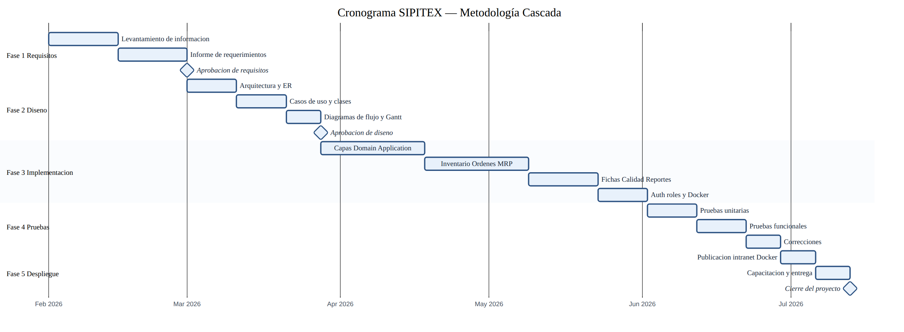

## 4.2 Cuadro comparativo de proveedores / tecnologías

Antes de seleccionar el stack tecnológico se evaluaron alternativas de base de datos, IDE y sistema operativo:

| Software | Definición | Características | Ventajas | Desventajas |
|----------|------------|-----------------|----------|-------------|
| **SQLite** *(elegido)* | Motor SQL embebido | Archivo único, sin servidor dedicado | Ideal intranet, bajo footprint, fácil respaldo | Menos concurrente que motores cliente/servidor |
| PostgreSQL | SGBD relacional libre | MVCC, tipos avanzados, multiplataforma | Potente y escalable | Requiere servidor y administración extra |
| MySQL | SGBD popular open source | Multihilo, APIs amplias | Rápido en entornos web | Licenciamiento dual / configuración adicional |
| SQL Server | SGBD Microsoft | T-SQL, Management Studio | Integración Windows/empresa | Costo de licencias en ediciones comerciales |
| Oracle | SGBD empresarial | PL/SQL, alta disponibilidad | Potencia corporativa | Precio y complejidad excesivos para CMTC |
| Visual Studio / VS Code | IDE de desarrollo | Soporte C# / .NET | Productividad en ASP.NET | VS completo es pesado; VS Code + SDK basta |
| Windows 10/11 | Sistema cliente/servidor | Familiar en el centro | Bajo costo de adopción | Licencia Microsoft |
| Linux | SO libre tipo Unix | Estable para servidores | Gratuito, robusto | Curva de aprendizaje para algunos usuarios |

**Decisión:** ASP.NET Core MVC + EF Core + **SQLite** + Docker Compose, por equilibrio entre costo, facilidad de despliegue en intranet y alineación con el programa ADSO.

---

# 5. Casos de uso

## 5.1 Diagrama de casos de uso

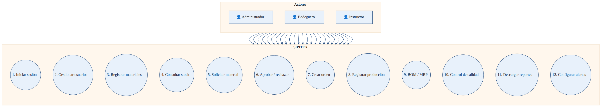

## 5.2 Matriz actor ↔ caso de uso

| Caso de uso | Admin | Bodeguero | Instructor |
|-------------|:-----:|:---------:|:----------:|
| 1. Iniciar sesión | ✓ | ✓ | ✓ |
| 2. Gestionar usuarios | ✓ | | |
| 3. Registrar materiales | ✓ | ✓ | con permiso |
| 4. Consultar stock | ✓ | ✓ | ✓ |
| 5. Solicitar material | ✓ | | ✓ |
| 6. Aprobar / rechazar | ✓ | ✓ | con permiso |
| 7. Crear orden | ✓ | | |
| 8. Registrar producción | ✓ | | ✓ |
| 9. BOM / MRP | ✓ | ✓ | con permiso |
| 10. Control de calidad | ✓ | | ✓ |
| 11. Descargar reportes | ✓ | ✓ | ✓ |
| 12. Configurar alertas | ✓ | parcial | parcial |

## 5.3 Descripción de casos de uso

### CU-01 — Iniciar sesión

| Campo | Valor |
|-------|-------|
| **Nombre** | Iniciar sesión |
| **Actores** | Administrador, Bodeguero, Instructor |
| **Función** | Autenticar al usuario y abrir sesión |
| **Descripción** | El usuario ingresa correo y contraseña. El sistema valida credenciales, crea cookie de autenticación y redirige según rol. |
| **Referencias** | RF02 |

### CU-02 — Gestión de usuarios

| Campo | Valor |
|-------|-------|
| **Nombre** | Gestión de usuarios |
| **Actores** | Administrador |
| **Función** | Mantenimiento de usuarios y permisos |
| **Descripción** | El Administrador puede crear, editar, activar/desactivar usuarios e asignar rol (Administrador, Instructor, Bodeguero) y permisos extendidos. |
| **Referencias** | RF01, RF03 |

### CU-03 — Registrar / consultar materiales

| Campo | Valor |
|-------|-------|
| **Nombre** | Administración de materiales |
| **Actores** | Administrador, Bodeguero |
| **Función** | Mantener inventario de materias primas |
| **Descripción** | Registrar material (código, nombre, unidad, stock, mínimo, estado). Consultar y filtrar por nivel de stock. Ajustar entradas y estado físico. |
| **Referencias** | RF04–RF07 |

### CU-04 — Solicitar material

| Campo | Valor |
|-------|-------|
| **Nombre** | Solicitar material |
| **Actores** | Instructor, Administrador |
| **Función** | Pedir salida de bodega asociada a una orden |
| **Descripción** | El actor selecciona orden y material (o crea material si no existe), indica cantidad y envía solicitud en estado Pendiente. |
| **Referencias** | RF08 |

### CU-05 — Aprobar / rechazar solicitud

| Campo | Valor |
|-------|-------|
| **Nombre** | Aprobar o rechazar solicitud |
| **Actores** | Bodeguero, Administrador |
| **Función** | Resolver solicitudes de material |
| **Descripción** | Al aprobar se descuenta stock; al rechazar se registra el motivo. Queda trazabilidad por orden. |
| **Referencias** | RF09 |

### CU-06 — Crear orden de producción

| Campo | Valor |
|-------|-------|
| **Nombre** | Crear orden de producción |
| **Actores** | Administrador |
| **Función** | Abrir orden con meta de unidades |
| **Descripción** | Se registra número de orden, producto, cantidad total, fecha límite y estado. El avance se actualiza con sesiones de producción. |
| **Referencias** | RF10, RF11 |

### CU-07 — BOM / MRP

| Campo | Valor |
|-------|-------|
| **Nombre** | Mantener BOM y simular MRP |
| **Actores** | Administrador, Bodeguero |
| **Función** | Definir materiales por producto y calcular faltantes |
| **Descripción** | Se agregan ítems al BOM (cantidad por unidad). La simulación MRP compara requerimiento neto vs stock disponible. |
| **Referencias** | RF12, RF13 |

### CU-08 — Registrar producción por ficha

| Campo | Valor |
|-------|-------|
| **Nombre** | Registrar producción |
| **Actores** | Instructor, Administrador |
| **Función** | Sesión diaria de producción |
| **Descripción** | Se asocia ficha a orden; se registran unidades y observaciones; se actualiza avance; si se alcanza la meta se finaliza la orden. |
| **Referencias** | RF14, RF15 |

### CU-09 — Control de calidad

| Campo | Valor |
|-------|-------|
| **Nombre** | Inspección de calidad |
| **Actores** | Instructor, Administrador |
| **Función** | Registrar inspección |
| **Descripción** | Se registran unidades inspeccionadas y resultado (Aprobado / Reproceso). En reproceso se exigen motivo y responsable. |
| **Referencias** | RF16 |

### CU-10 — Reportes y alertas

| Campo | Valor |
|-------|-------|
| **Nombre** | Reportes y alertas |
| **Actores** | Todos (según módulo) |
| **Función** | Exportar información y recibir avisos |
| **Descripción** | Exportación PDF/Excel con filtros. Preferencias de alerta por usuario (stock bajo, solicitudes pendientes, órdenes atrasadas, reprocesos). |
| **Referencias** | RF17–RF20 |

---

# 6. Diagrama de flujo

## 6.1 Flujo principal: solicitud de material y producción

El siguiente diagrama describe el flujo desde el inicio de sesión hasta la resolución de una solicitud de material, el registro de producción y la inspección de calidad.

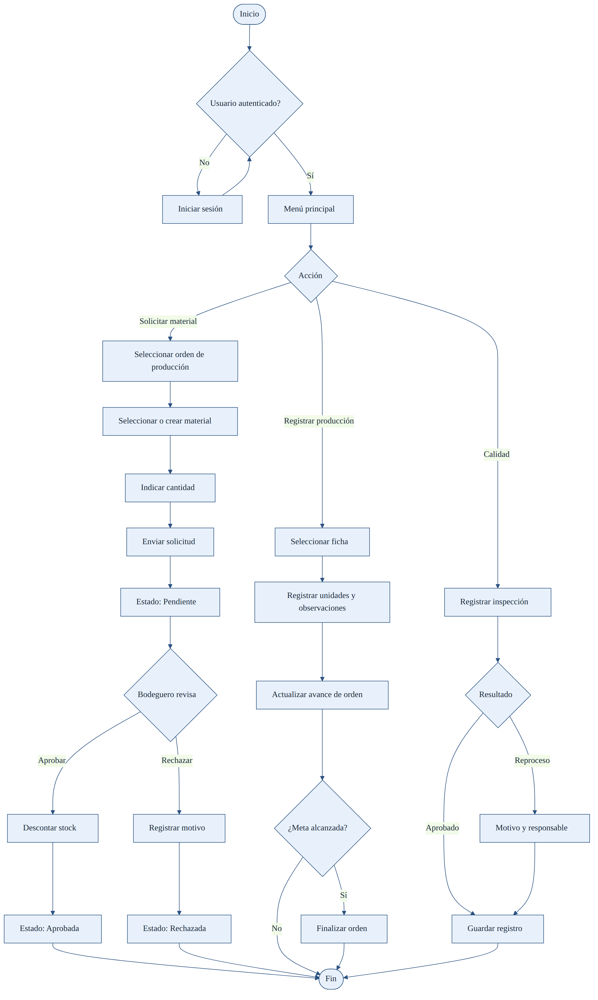

## 6.2 Flujos de secuencia (detalle técnico)

Complementan el flujo lógico con el orden de mensajes entre capas:

| Flujo | Imagen |
|-------|--------|
| Login | 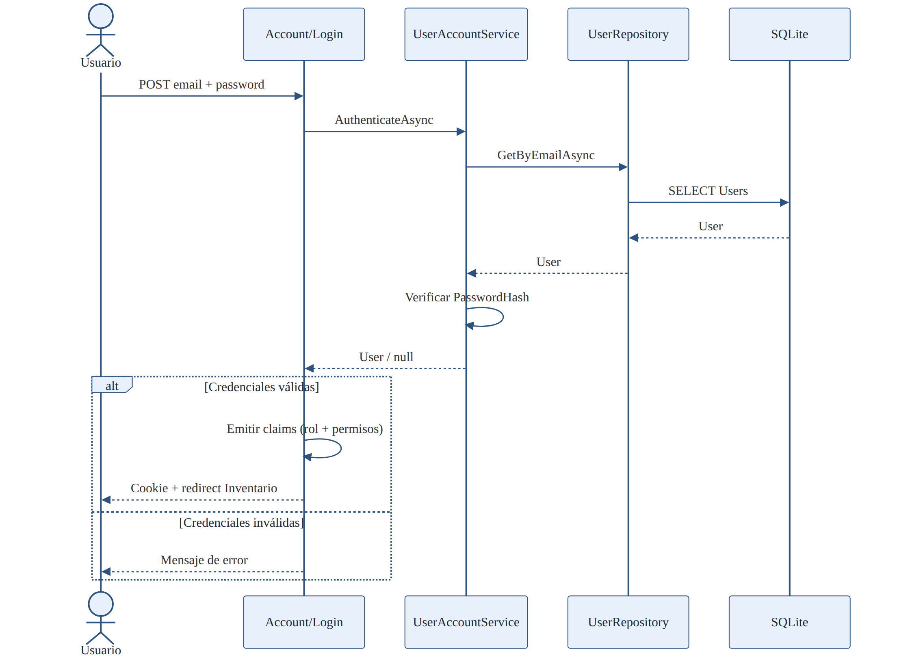 |
| Solicitar material | 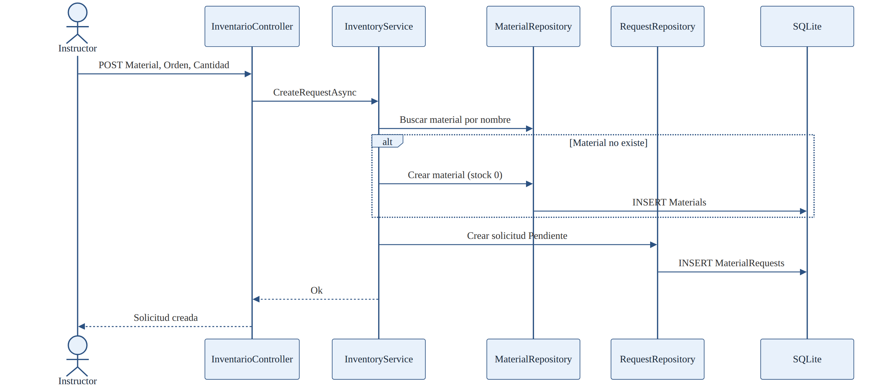 |
| Aprobar solicitud | 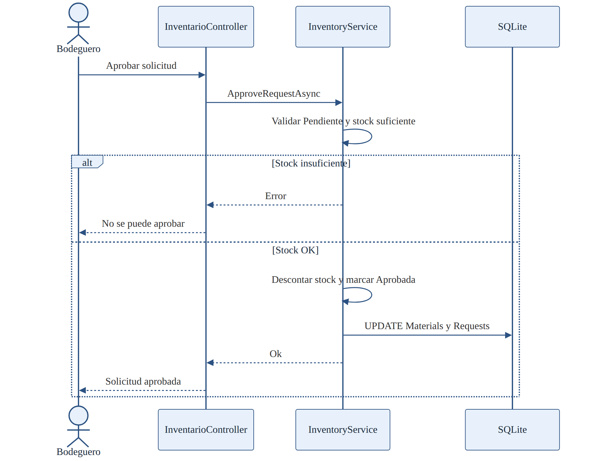 |
| Crear orden | 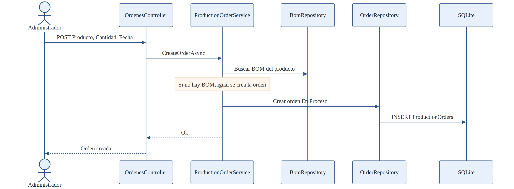 |
| Reportes | 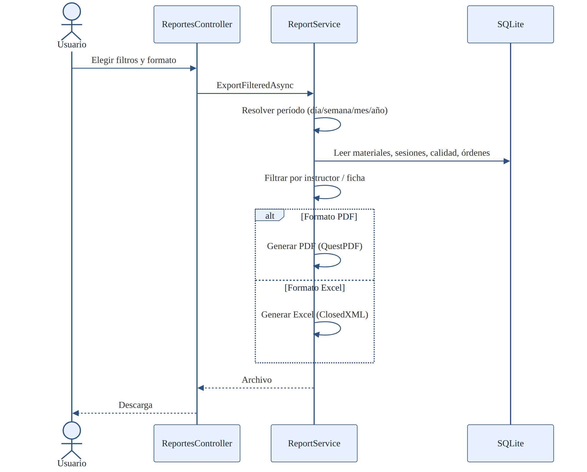 |
| Agregar BOM | 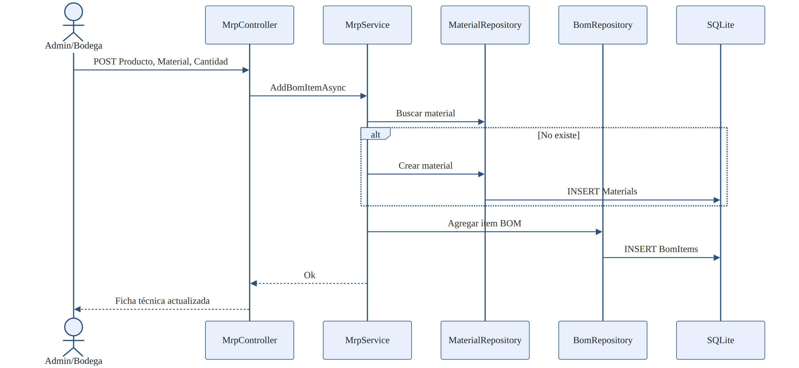 |

## 6.3 Descripción narrativa del flujo de solicitud

1. El Instructor inicia sesión.  
2. Selecciona una orden de producción activa.  
3. Elige material existente o registra uno nuevo.  
4. Indica cantidad y envía la solicitud (estado **Pendiente**).  
5. El Bodeguero revisa la solicitud.  
6. Si **aprueba**, el sistema descuenta stock y marca **Aprobada**.  
7. Si **rechaza**, registra motivo y marca **Rechazada**.  
8. Queda trazabilidad asociada a la orden.

---

# 7. Diagrama de clases

## 7.1 Clases del dominio

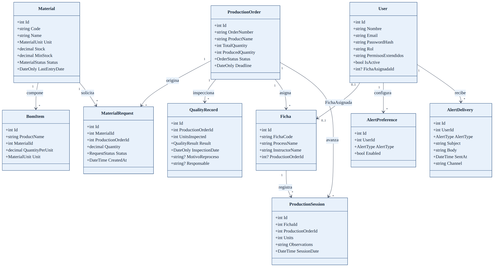

## 7.2 Vista de capas de aplicación

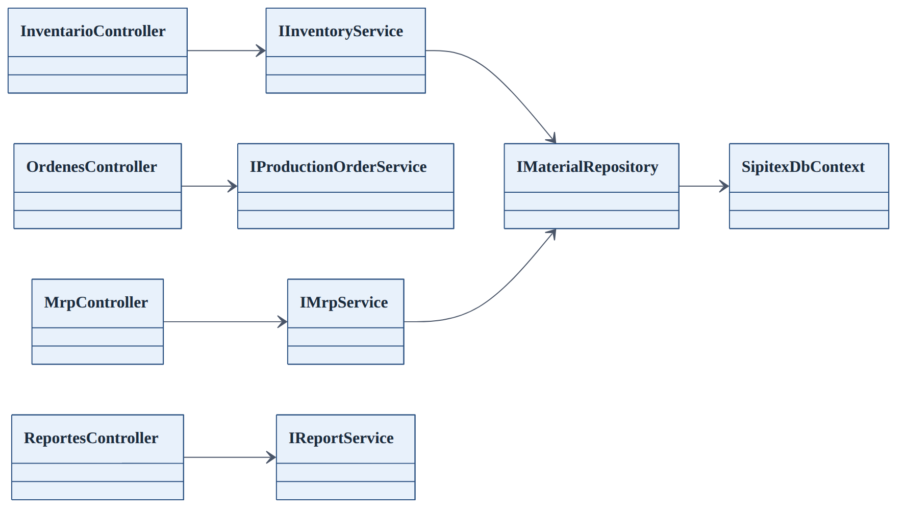

## 7.3 Resumen de entidades

| Clase | Responsabilidad |
|-------|-----------------|
| `User` | Usuarios, rol, permisos, ficha asignada |
| `Material` | Inventario de materias primas |
| `BomItem` | Material por unidad de producto |
| `ProductionOrder` | Órdenes de producción y avance |
| `MaterialRequest` | Solicitudes de salida de bodega |
| `Ficha` | Proceso / grupo asociado a instructor y orden |
| `ProductionSession` | Registro diario de unidades |
| `QualityRecord` | Inspecciones de calidad |
| `AlertPreference` / `AlertDelivery` | Preferencias y envíos de alertas |

## 7.4 Patrones aplicados

- **Repository + Unit of Work**  
- **DTO** (desacoplar entidades de la UI)  
- **Dependency Injection**  

---

# 8. Diagrama de distribución

## 8.1 Despliegue físico / lógico

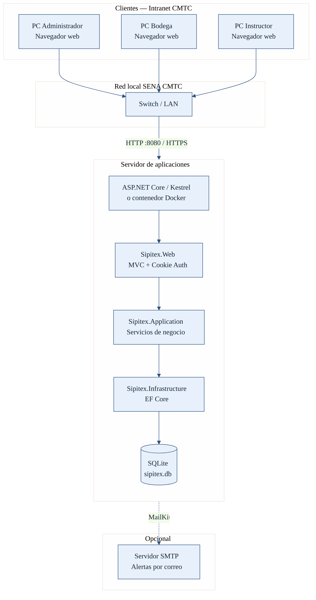

## 8.2 Arquitectura por capas (vista lógica)

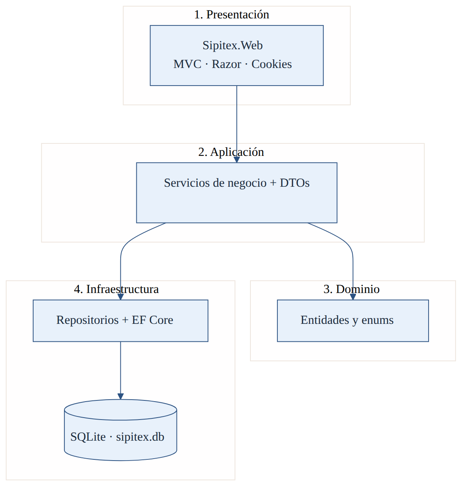

## 8.3 Nodos de despliegue

| Nodo | Componentes | Protocolo |
|------|-------------|-----------|
| PCs de usuarios (Admin, Bodega, Instructor) | Navegador web | HTTP/HTTPS |
| Switch / LAN CMTC | Red local | Ethernet |
| Servidor de aplicaciones | Kestrel / Docker · Sipitex.Web | Puerto 8080 (Compose) o IIS |
| Almacenamiento | `sipitex.db` (SQLite) o volumen Docker | Archivo local |
| SMTP (opcional) | MailKit | SMTP |

## 8.4 Opciones de publicación

1. **Local:** `dotnet run` en `src/Sipitex.Web`.  
2. **Publish:** `dotnet publish -c Release` + IIS o ejecutable.  
3. **Docker Compose:** `docker compose up --build` → `http://localhost:8080`.

---

# 9. Modelo entidad relación

## 9.1 Diagrama ER

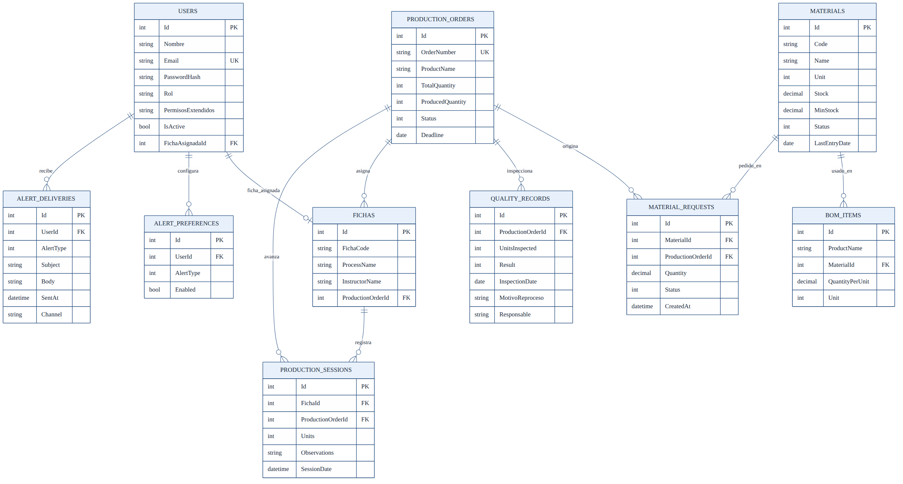

## 9.2 Relaciones principales

| Relación | Cardinalidad | Descripción |
|----------|--------------|-------------|
| USERS → FICHAS | 0..1 | Ficha asignada al usuario |
| MATERIALS → BOM_ITEMS | 1..* | Material usado en BOM |
| MATERIALS → MATERIAL_REQUESTS | 1..* | Material pedido |
| PRODUCTION_ORDERS → MATERIAL_REQUESTS | 1..* | Solicitudes de la orden |
| PRODUCTION_ORDERS → QUALITY_RECORDS | 1..* | Inspecciones |
| PRODUCTION_ORDERS → FICHAS | 1..* | Fichas asignadas |
| FICHAS → PRODUCTION_SESSIONS | 1..* | Sesiones de producción |
| USERS → ALERT_PREFERENCES | 1..* | Preferencias de alerta |

## 9.3 Diccionario resumido de tablas (anticipación al punto 10)

| Tabla | Clave | Campos clave |
|-------|-------|--------------|
| `USERS` | Id | Nombre, Email, PasswordHash, Rol, PermisosExtendidos, IsActive, FichaAsignadaId |
| `MATERIALS` | Id | Code, Name, Unit, Stock, MinStock, Status, LastEntryDate |
| `BOM_ITEMS` | Id | ProductName, MaterialId, QuantityPerUnit, Unit |
| `PRODUCTION_ORDERS` | Id | OrderNumber, ProductName, TotalQuantity, ProducedQuantity, Status, Deadline |
| `MATERIAL_REQUESTS` | Id | MaterialId, ProductionOrderId, Quantity, Status, CreatedAt |
| `FICHAS` | Id | FichaCode, ProcessName, InstructorName, ProductionOrderId |
| `PRODUCTION_SESSIONS` | Id | FichaId, ProductionOrderId, Units, Observations, SessionDate |
| `QUALITY_RECORDS` | Id | ProductionOrderId, UnitsInspected, Result, InspectionDate, MotivoReproceso, Responsable |
| `ALERT_PREFERENCES` | Id | UserId, AlertType, Enabled |
| `ALERT_DELIVERIES` | Id | UserId, AlertType, Subject, Body, SentAt, Channel |

## 9.4 Integridad

- Claves foráneas gestionadas por EF Core.  
- Transacciones en operaciones críticas (aprobación de solicitud + descuento de stock).  
- Migraciones EF Core (`MigrateAsync`) al arrancar; baseline automático para BD legacy.

---

## Apéndice A — Credenciales de demostración

| Rol | Correo | Contraseña |
|-----|--------|------------|
| Administrador | `admin@sipitex.test` | `Admin123!` |
| Instructor | `instructor@sipitex.test` | `Instructor123!` |  
| Bodeguero | `bodega@sipitex.test` | `Bodega123!` |

## Apéndice B — Cómo ejecutar

```bash
cd src/Sipitex.Web
dotnet run
```

```bash
docker compose up --build
# http://localhost:8080
```

---

*Fin del documento formativo SIPITEX — puntos 1 a 9 · v1.0*
